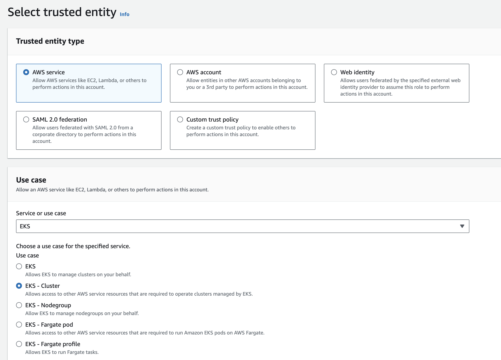
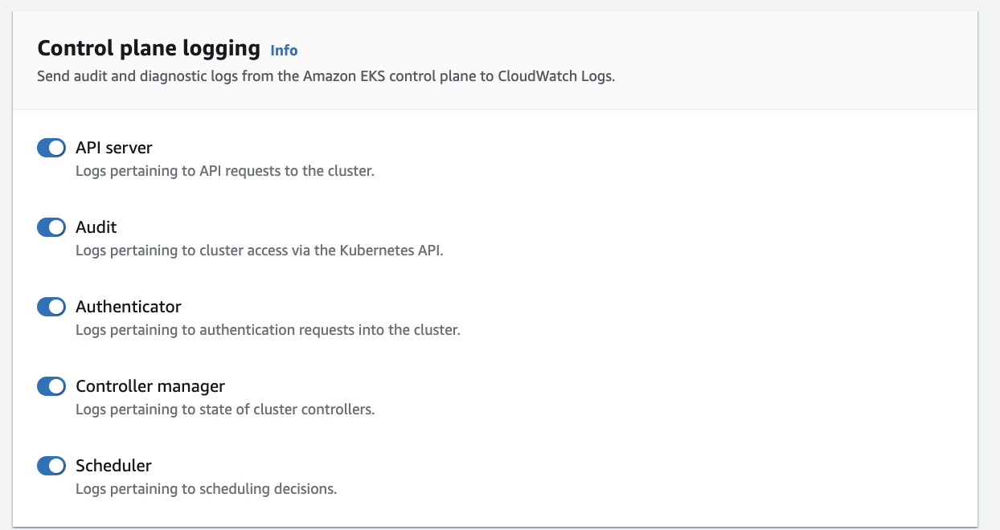

# EKS - Documentation
###0.PreRequisites

- **eksctl**    - A command line tool for working with EKS clusters that automates many individual tasks
- **kubectl**   - A command line tool for working with Kubernetes clusters
- **awscli**    - The AWS Command Line Interface (AWS CLI) is an open source tool from Amazon Web Services (AWS). You can use it to interact with AWS services using commands in your command line shell.


### 0.1 eksctl 
  To install or upgrade eksctl on Windows using Chocolatey

Install the binaries with the following command.

   ``` 
   chocolatey install -y eksctl 
   ```


If they are already installed, run the following command to upgrade:


```
chocolatey upgrade -y eksctl 
```

Test that your installation was successful with the following command. You must have eksctl 0.34.0 version or later.

  ```
  eksctl version
```

#### 0.2 Kubectl
To install kubectl on Windows you can use Chocolatey package manager

```
choco install kubernetes-cli
```
Test to ensure the version you installed is up-to-date:
```
kubectl version --client
```
Navigate to your home directory:

```
cd ~
```
Create the .kube directory:

```
mkdir .kube
```
Change to the .kube directory you just created:
```
cd .kube
```
Configure kubectl to use a remote Kubernetes cluster:

```
New-Item config -type file
```
Note: Edit the config file with a text editor of your choice, such as Notepad. 
#### 0.3 aws cli
**Install or update the AWS CLI**
To update your current installation of AWS CLI on Windows, download a new installer each time you update to overwrite previous versions.

Download and run the AWS CLI MSI installer for Windows (64-bit):

```
https://awscli.amazonaws.com/AWSCLIV2.msi
```

Alternatively, you can run the msiexec command to run the MSI installer.


```
C:\> msiexec.exe /i https://awscli.amazonaws.com/AWSCLIV2.msi
```
For various parameters that can be used with msiexec, see msiexec on the Microsoft Docs website. For example, you can use the /qn flag for a silent installation.


```
C:\> msiexec.exe /i https://awscli.amazonaws.com/AWSCLIV2.msi /qn
```

To confirm the installation, open the Start menu, search for cmd to open a command prompt window, and at the command prompt use the following command.
```
C:\> aws --version
```
### 1.0 EKS Cluster Management

### IAM Roles for EKS Cluster and Worker Nodes

When creating an Amazon Elastic Kubernetes Service (EKS) cluster, you need to assign certain roles to ensure proper functioning and integration with other AWS services. The main roles required during cluster creation are:

**AmazonEKSClusterPolicy:** This role grants the necessary permissions to create and manage an EKS cluster. It includes permissions such as creating and deleting the cluster, updating its configuration, and attaching and detaching IAM roles for Kubernetes service accounts.

**AmazonEKSServicePolicy:** This role allows the Kubernetes control plane to make calls to AWS APIs on your behalf. It is necessary for EKS to manage resources like Elastic Load Balancers (ELBs) and Elastic Block Store (EBS) volumes.

**AmazonEKSServiceRole:** This role is used by the EKS control plane to manage AWS resources on your behalf. It enables the control plane to create, describe, and delete AWS resources like ENIs, Route Tables, and Security Groups.

**AmazonEKSCNIPolicy:** If you're using the Amazon VPC CNI (Container Network Interface) plugin for your EKS cluster, you need this role to allow Kubernetes to manage network interfaces in your VPC. This role provides permissions to create, describe, and delete network interfaces.

### Create an Role with necessary policies

**a. Create an Role via the CLI**

1. Copy the following contents to a file named eks-cluster-role-trust-policy.json
```
{
  "Version": "2012-10-17",
  "Statement": [
    {
      "Effect": "Allow",
      "Principal": {
        "Service": "eks.amazonaws.com"
      },
      "Action": "sts:AssumeRole"
    }
  ]
}
```
2. Create the role

```
aws iam create-role \
  --role-name JumisaEKSClusterRole \
  --assume-role-policy-document file://"eks-cluster-role-trust-policy.json"
```
3. Attach the required Amazon EKS managed IAM policy to the role.

```
aws iam attach-role-policy \
  --policy-arn arn:aws:iam::aws:policy/AmazonEKSClusterPolicy \
  --role-name JumisaEKSClusterRole

```

**Create an Role via the Console**

1. Open the IAM console at https://console.aws.amazon.com/iam/.

2. Choose Roles, then Create role.


3. Under Trusted entity type, select AWS service.


4. From the Use cases for other AWS services dropdown list, choose EKS.
5. Choose EKS - Cluster for your use case, and then choose Next.




6. On the Add permissions tab, choose Next.


7. For Role name, enter a unique name for your role, such as eksClusterRole.
8. For Description, enter descriptive text such as Amazon EKS - Cluster role.


9. Choose Create role.


### Create an EKS Cluster
   **a.**  Create an EKS Cluster by using eksctl

   Create your Amazon EKS cluster with the following command. You can replace `jumisa-demo` with your own value. The name can contain only alphanumeric characters (case-sensitive) and hyphens. It must start with an alphabetic character and can't be longer than 100 characters. Replace `us-east-1` with any AWS Region that is supported by Amazon EKS. Replace subnet ID's with your own subnet ID's


   ```
   eksctl create cluster --name jumisa-demo --region us-east-1 --version 1.25 --vpc-private-subnets subnet-ID1,subnet-ID2 --without-nodegroup
   ```
   Cluster creation takes several minutes. During creation you'll see several lines of output. The last line of output is similar to the following example line.

`
 [...]
 [✓]  EKS cluster "jumisa-demo" in "us-east-1" region is ready 
`

You can check the created cluster under *EKS > Cluster* in the aws console as well


**b.** Create an EKS Cluster by using AWS console
 1. Open the Amazon EKS console at https://console.aws.amazon.com/eks/home#/clusters
 2. Choose Add cluster and then choose Create
 
 3. On the Configure cluster page, enter the following fields:

  a. Name – A name for your cluster. It must be unique in your AWS account. The name can contain only alphanumeric characters (case-sensitive) and hyphens. It must start with an alphabetic character and can't be longer than 100 characters. The name must be unique within the AWS Region and AWS account that you're creating the cluster in.

  b. Kubernetes version – The version of Kubernetes to use for your cluster. We recommend selecting the latest version, unless you need an earlier version.
  
  c. Cluster service role – Choose the Amazon EKS cluster IAM role that you created to allow the Kubernetes control plane to manage AWS resources on your behalf.
  
  d. Secrets encryption – (Optional) Choose to enable secrets encryption of Kubernetes secrets using a KMS key. You can also enable this after you create your cluster. Before you enable this capability, make sure that you're familiar with the information in Enabling secret encryption on an existing cluster.
  
  e. Tags – (Optional) Add any tags to your cluster. For more information, see Tagging your Amazon EKS  resources. 

  


f. Then click Next to Proceed the **Network and VPC Configuration** 

1. VPC – Choose an existing VPC. You can't change which VPC you want to use after cluster creation. If no VPCs are listed, then you need to create one first.

2. Subnets – By default, all available subnets in the VPC specified in the previous field are preselected. You must select at least two.

3. Security groups – (Optional) Specify one or more security groups that you want Amazon EKS to associate to the network interfaces that it creates. Whether you choose any security groups or not, Amazon EKS creates a security group that enables communication between your cluster and your VPC.
 
4. **Cluster Endpoint Access** -  the cluster endpoint is the endpoint used to communicate with the Kubernetes API server

 **a. Public Endpoint Access:** With a public endpoint, the Kubernetes API server is accessible over the public internet. This means that clients outside of your network can connect to the cluster endpoint using the internet. It's commonly used when you have developers or services running outside of your AWS environment that need to interact with the Kubernetes API.

 **b. Private Endpoint Access:** With a private endpoint, the Kubernetes API server is only accessible from within your AWS Virtual Private Cloud (VPC). This means that clients need to be within the VPC or connected to it through a VPC peering connection, VPN, or AWS Direct Connect to access the cluster endpoint. Private endpoint access enhances security by restricting access to the Kubernetes API server to within your private network.

 

g. If you've enabled Public access, you can specify which addresses from the internet can communicate to the public endpoint. Select Advanced Settings. Enter a CIDR block, such as `192.168.0.100/32`. Then only the CIDR `192.168.0.100/32` from the internet can access your Kubernetes API Server. We can add upto 30 CIDR by using Add source button in the Console. 


h. **Enable Logging for EKS Cluster** - It allows you to capture and analyze logs generated by the Kubernetes control plane components running in your EKS cluster. You can see this logs in Cloud Watch logs.

 **API Server Logs:**

The API server is the central management entity in a Kubernetes cluster. It exposes the Kubernetes API, which allows users and applications to interact with the cluster, such as deploying applications, scaling workloads, and managing resources.
API server logs capture events related to incoming API requests and responses. They provide insights into API server activities, such as authentication, authorization, request processing, and admission control.
**Audit Logs:**
Audit logging provides a record of API requests and responses for auditing and compliance purposes. It helps track who accessed the Kubernetes API server, what actions were performed, and when they occurred.It gives information including the user identity, requested operation, requested resource, response status code, and timestamps. They enable administrators to review and analyze API activity, detect unauthorized access or suspicious behavior, and ensure compliance with security policies and regulations.

**Authenticator Logs:**

The authenticator is responsible for verifying the identity of users and services accessing the Kubernetes API server. It supports various authentication methods, such as client certificates, bearer tokens, and AWS IAM roles (in the case of Amazon EKS).Authenticator logs provide information about authentication attempts and outcomes, including successful logins, failed authentication attempts, and authentication errors.

**Controller Manager Logs:**

The controller manager is a Kubernetes component responsible for managing various controllers that control different aspects of the cluster, such as deployments, replica sets, services, and endpoints.Controller manager logs contain information about the operation of controller processes, including controller initialization, reconciliation loops, resource creation and deletion, event handling, and error handling. They provide insights into controller behavior, performance, and reliability.

**Scheduler Logs:**

The scheduler is responsible for selecting suitable nodes for newly created pods based on resource requirements, constraints, and other factors specified in pod specifications.Scheduler logs capture messages related to pod scheduling decisions, including scheduling algorithms, node selection criteria, scheduling constraints, and scheduling events. They help administrators understand how pods are being scheduled in the cluster and diagnose issues related to pod placement.


i. On the Select add-ons page, choose the add-ons that you want to add to your cluster. You can choose as many Amazon EKS add-ons and AWS Marketplace add-ons as you require

j. On the Configure selected add-ons settings page, select the version that you want to install.

k. Then click create to you can create a cluster
### List EKS Clusters
List the Amazon EKS clusters in your Amazon Web Services account in the specified Amazon Web Services Region by using the following command.

```
 aws eks list-clusters --region=us-east-1
```
You can get the list of the clusters in your account like below

```
{
    "clusters": [
        "jumisa-demo"
    ]
}
```

### Describe an EKS Cluster
  Describes an Amazon EKS cluster via aws cli by using the following command
  ```
  aws eks describe-cluster --name jumisa-demo --region=us-east-1
```
You can get your cluster details like below

```
{
    "cluster": {
        "name": "jumisa-demo",
        "arn": "arn:aws:eks:us-east-1:522820335540:cluster/jumisa-demo",
        "createdAt": "2024-02-09T15:22:50.837000+05:30",
        "version": "1.25",
        "endpoint": "https://DAB6EFEDF8D8DA8289369B03D41DCF6E.gr7.us-east-1.eks.amazonaws.com",
        "roleArn": "arn:aws:iam::522820335540:role/eksctl-jumisa-demo-cluster-ServiceRole-hxUhXiTSVrX3",
        "resourcesVpcConfig": {
            "subnetIds": [
                "subnet-03999156e20e1e34a",
                "subnet-0aaf269e2c7bbb341",
                "subnet-06332a3960be9fb2d",
                "subnet-0c08cb9357c827478",
                "subnet-0cc43a4fb47068a33",
                "subnet-01ed194a902fc2206"
            ],
            "securityGroupIds": [
                "sg-03875add9521643c2"
            ],
            "clusterSecurityGroupId": "sg-0d486fb60d639bb1c",
            "vpcId": "vpc-03aaa3dae713ac4f4",
            "endpointPublicAccess": true,
            "endpointPrivateAccess": false,
            "publicAccessCidrs": [
                "0.0.0.0/0"
            ]
        },
        "kubernetesNetworkConfig": {
            "serviceIpv4Cidr": "10.100.0.0/16",
            "ipFamily": "ipv4"
        },
        "logging": {
            "clusterLogging": [
                {
                    "types": [
                        "api",
                        "audit",
                        "authenticator",
                        "controllerManager",
                        "scheduler"
                    ],
                    "enabled": false
                }
            ]
        },
        "identity": {
            "oidc": {
                "issuer": "https://oidc.eks.us-east-1.amazonaws.com/id/DAB6EFEDF8D8DA8289369B03D41DCF6E"
            }
        },
        "status": "ACTIVE",
        "certificateAuthority": {
            "data": "LS0tLS1CRUdJTiBDRVJUSUZJQ0FURS0tLS0tCk1JSURCVENDQWUyZ0F3SUJBZ0lJTEFVMzVRaGxZMnN3RFFZSktvWklodmNOQVFFTEJRQXdGVEVUTUJFR0ExVUUKQXhNS2EzVmlaWEp1WlhSbGN6QWVGdzB5TkRBeU1Ea3dPVFV4TkRKYUZ3MHpOREF5TURZd09UVTJOREphTUJVeApFekFSQmdOVkJBTVRDbXQxWW1WeWJtVjBaWE13Z2dFaU1BMEdDU3FHU0liM0RRRUJBUVVBQTRJQkR3QXdnZ0VLCkFvSUJBUUMrak1DbGNuVXJOM3kyc0hQQmtpZmpQT2pWM09CZ0YweWlLdlhOTk5IRzdMRW0rNnlRRUl2VjJvc2wKNU5xU2RyZi9KL05ncnF
vd0t5ZzdxQ1J4YUtlVElCRUtYb2poM3Q4cDhOWHVnUWpzZU9TcHlxZHlkc0FyQkdDYwpWajFVL3lWMlZtcjVtZnUvejlma2VGZkxUWDgvYVh3bnBqY0dlR2dnMFNDRzYzcVMyNnF0b01YNkx6c2g1NDk0CktMUld3Vy91OUxOUFdMUFFxeExTM05DcDEyWjNHZXNTbFIrOHBvSHdkdGp
4TkE0azloOFBOSFZuWlN0R0RBZUMKZlU2cHJ5WU9mQ01YOW5BdVdHZGlmSVh4OFk3K1ljenY5ZkpWRVhIUko5cFR6VVRVOFdKd0JuWDUwU0VEM1pQNQpkZmNubEgwT095OGdMdk9BQVlhTkRaalEza1kxQWdNQkFBR2pXVEJYTUE0R0ExVWREd0VCL3dRRUF3SUNwREFQCkJnTlZIUk1
CQWY4RUJUQURBUUgvTUIwR0ExVWREZ1FXQkJUYmVnWGpTRm53Yy9mY3NmZXNwdHNzQ3VUT3NUQVYKQmdOVkhSRUVEakFNZ2dwcmRXSmxjbTVsZEdWek1BMEdDU3FHU0liM0RRRUJDd1VBQTRJQkFRQ3Y0Mi94blFZcwp6akl6SERuVzRKS1MvRzYwdmRGRnQ1T1FsOURrVHVKSklOWGo
zVjNYbGh2V1VaMllvWkIvZ3JnSUx5QmhKTzlyClZJZ3NEdkJGalUwcnBzUjh2V0VVUU9oV0xYa01hb3hPYVNJUnhiUFNuUVltRHhUbms1NVZuYjUxWGZMY1dXZjkKc0dMaG1IM0JhV1hqUll0ZTBxNDlZUVp1eVpxN0J6alo1ZE5WL3dlazlqYmVvYUx0K2dTUnpsZXBvSjdDN09hNAp
nQy9ZN0YwbUdVNWYwVlFWbEs1eEpNa2JPSVJZNXdqc2Y0YWl1Y3ozT21ta2JYZFU5WktNc05hS28ydFhoc1NLCmQvcm5hRHBIQzRmVVE4L1pRSENxSEZ0WUwyYng0d0oyVDhOYlQwV2diV2YrTTNoWlp1L0tWdm8rOCtRNTdzN1IKU291ZG5UVURIaGx3Ci0tLS0tRU5EIENFUlRJRkl
DQVRFLS0tLS0K"
        },
        "platformVersion": "eks.13",
        "tags": {
            "aws:cloudformation:stack-name": "eksctl-jumisa-demo-cluster",
            "alpha.eksctl.io/cluster-name": "jumisa-demo",
            "aws:cloudformation:stack-id": "arn:aws:cloudformation:us-east-1:522820335540:stack/eksctl-jumisa-demo-cluster/ec8a7a80-c730-11ee-91d8-020a12a50a4f",
            "eksctl.cluster.k8s.io/v1alpha1/cluster-name": "jumisa-demo",
            "alpha.eksctl.io/cluster-oidc-enabled": "false",
            "aws:cloudformation:logical-id": "ControlPlane",
            "alpha.eksctl.io/eksctl-version": "0.141.0",
            "Name": "eksctl-jumisa-demo-cluster/ControlPlane"
        },
        "health": {
            "issues": []
        }
    }
}
```
The API server endpoint and certificate authority data returned by this operation are required for kubelet and kubectl to communicate with your Kubernetes API server.


  ### Update EKS Cluster Version
  Update an EKS Cluster Version by using the eksctl

  ```
   eksctl upgrade cluster jumisa-demo  --version=1.26 --region=us-east-1 --approve
  ```
  Cluster version upgradation takes several minutes. During upgradation you'll see several lines of output. The output is similar to the following example line.
```
2024-02-09 16:41:46 [ℹ]  will upgrade cluster "jumisa-demo" control plane from current version "1.25" to "1.26"
2024-02-09 16:51:06 [✔]  cluster "jumisa-demo" control plane has been upgraded to version "1.26"
2024-02-09 16:51:06 [ℹ]  you will need to follow the upgrade procedure for all of nodegroups and add-ons
2024-02-09 16:51:07 [ℹ]  re-building cluster stack "eksctl-jumisa-demo-cluster"
2024-02-09 16:51:07 [✔]  all resources in cluster stack "eksctl-jumisa-demo-cluster" are up-to-date
2024-02-09 16:51:08 [ℹ]  checking security group configuration for all nodegroups
2024-02-09 16:51:08 [ℹ]  all nodegroups have up-to-date cloudformation templates
```
- ### NOTE: ***upgrading more than one version at a time is not supported***

Update an EKS Cluster Version By using the Console

### Delete an EKS Cluster

  After you've finished with the cluster and nodes that you created for this tutorial, you should clean up by deleting the cluster and nodes with the following command.

```
eksctl delete cluster --name jumisa-demo --region us-east-1 
 ```
```
2024-02-10 00:21:30 [ℹ]  deleting EKS cluster "jumisa-demo"
2024-02-10 00:21:32 [ℹ]  will drain 0 unmanaged nodegroup(s) in cluster "jumisa-demo"
2024-02-10 00:21:32 [ℹ]  starting parallel draining, max in-flight of 1
2024-02-10 00:21:38 [ℹ]  deleted 0 Fargate profile(s)
2024-02-10 00:21:41 [ℹ]  cleaning up AWS load balancers created by Kubernetes objects of Kind Service or Ingress
2024-02-10 00:21:44 [ℹ]
2 sequential tasks: { delete nodegroup "ng-2b894557", delete cluster control plane "jumisa-demo" [async]
}
2024-02-10 00:21:44 [ℹ]  will delete stack "eksctl-jumisa-demo-nodegroup-ng-2b894557"
2024-02-10 00:21:44 [ℹ]  waiting for stack "eksctl-jumisa-demo-nodegroup-ng-2b894557" to get deleted
2024-02-10 00:21:44 [ℹ]  waiting for CloudFormation stack "eksctl-jumisa-demo-nodegroup-ng-2b894557"
2024-02-10 00:22:16 [ℹ]  waiting for CloudFormation stack "eksctl-jumisa-demo-nodegroup-ng-2b894557"
2024-02-10 00:23:15 [ℹ]  waiting for CloudFormation stack "eksctl-jumisa-demo-nodegroup-ng-2b894557"
2024-02-10 00:24:57 [ℹ]  waiting for CloudFormation stack "eksctl-jumisa-demo-nodegroup-ng-2b894557"
2024-02-10 00:25:42 [ℹ]  waiting for CloudFormation stack "eksctl-jumisa-demo-nodegroup-ng-2b894557"
2024-02-10 00:27:16 [ℹ]  waiting for CloudFormation stack "eksctl-jumisa-demo-nodegroup-ng-2b894557"
2024-02-10 00:28:32 [ℹ]  waiting for CloudFormation stack "eksctl-jumisa-demo-nodegroup-ng-2b894557"
2024-02-10 00:29:15 [ℹ]  waiting for CloudFormation stack "eksctl-jumisa-demo-nodegroup-ng-2b894557"
2024-02-10 00:29:15 [ℹ]  will delete stack "eksctl-jumisa-demo-cluster"
2024-02-10 00:29:15 [✔]  all cluster resources were deleted
```

### 2.0 Node Group Management

 ### Create Node Group
 a. create an Node Group using eksctl
 ```
 eksctl create nodegroup --cluster jumisa-demo --region us-east-1 --name demo-ng  --node-ami-family AmazonLinux2 --node-type m5.large --nodes 1 --nodes-min 1  --nodes-max 4
 ```
  Node group creation takes few minutes. During the creation you'll see several lines of output. The output is similar to the following example line.
  ```
  2024-02-09 17:58:45 [ℹ]  will use version 1.26 for new nodegroup(s) based on control plane version
2024-02-09 17:58:48 [ℹ]  nodegroup "demo-ng" will use "" [AmazonLinux2/1.26]
2024-02-09 17:58:49 [ℹ]  1 existing nodegroup(s) (ng-2b894557) will be excluded
2024-02-09 17:58:49 [ℹ]  1 nodegroup (demo-ng) was included (based on the include/exclude rules)
2024-02-09 17:58:49 [ℹ]  will create a CloudFormation stack for each of 1 managed nodegroups in cluster "jumisa-demo"
2024-02-09 17:58:49 [ℹ]
2 sequential tasks: { fix cluster compatibility, 1 task: { 1 task: { create managed nodegroup "demo-ng" } }
}
2024-02-09 17:58:49 [ℹ]  checking cluster stack for missing resources
2024-02-09 17:58:50 [ℹ]  cluster stack has all required resources
2024-02-09 17:58:50 [ℹ]  building managed nodegroup stack "eksctl-jumisa-demo-nodegroup-demo-ng"
2024-02-09 17:58:51 [ℹ]  deploying stack "eksctl-jumisa-demo-nodegroup-demo-ng"
2024-02-09 17:58:51 [ℹ]  waiting for CloudFormation stack "eksctl-jumisa-demo-nodegroup-demo-ng"
2024-02-09 17:59:21 [ℹ]  waiting for CloudFormation stack "eksctl-jumisa-demo-nodegroup-demo-ng"
2024-02-09 18:00:20 [ℹ]  waiting for CloudFormation stack "eksctl-jumisa-demo-nodegroup-demo-ng"
2024-02-09 18:01:06 [ℹ]  waiting for CloudFormation stack "eksctl-jumisa-demo-nodegroup-demo-ng"
2024-02-09 18:03:00 [ℹ]  waiting for CloudFormation stack "eksctl-jumisa-demo-nodegroup-demo-ng"
2024-02-09 18:03:01 [ℹ]  no tasks
2024-02-09 18:03:01 [✔]  created 0 nodegroup(s) in cluster "jumisa-demo"
2024-02-09 18:03:01 [ℹ]  nodegroup "demo-ng" has 1 node(s)
2024-02-09 18:03:01 [ℹ]  node "ip-192-168-0-143.us-east-1.compute.internal" is ready
2024-02-09 18:03:01 [ℹ]  waiting for at least 1 node(s) to become ready in "demo-ng"
2024-02-09 18:03:01 [ℹ]  nodegroup "demo-ng" has 1 node(s)
2024-02-09 18:03:01 [ℹ]  node "ip-192-168-0-143.us-east-1.compute.internal" is ready
2024-02-09 18:03:01 [✔]  created 1 managed nodegroup(s) in cluster "jumisa-demo"
2024-02-09 18:03:02 [ℹ]  checking security group configuration for all nodegroups
2024-02-09 18:03:02 [ℹ]  all nodegroups have up-to-date cloudformation templates
  ```
b. Creating a Node Group using Console.
1. Open the Amazon EKS console at https://console.aws.amazon.com/eks/home#/clusters
2. Choose the name of the cluster that you want to create a managed node group in.
3. Select the Compute tab

4. Choose Add node group.

5. On the Configure node group page, fill out the parameters accordingly, and then choose Next.

Name – Enter a unique name for your managed node group. The node group name can't be longer than 63 characters. It must start with letter or digit, but can also include hyphens and underscores for the remaining characters.

Node IAM role – Choose the node instance role to use with your node group.


6. On the Set compute and scaling configuration page, fill out the parameters accordingly, and then choose Next.

AMI type – Select an AMI type.

Capacity type – Select a capacity type.

Instance types – By default, one or more instance type is specified. To remove a default instance type, select the X on the right side of the instance type. Choose the instance types to use in your managed node group. 

Disk size – Enter the disk size (in GiB) to use for your node's root volume

Desired size – Specify the current number of nodes that the managed node group should maintain at launch.

Minimum size – Specify the minimum number of nodes that the managed node group can scale in to.

Maximum size – Specify the maximum number of nodes that the managed node group can scale out to.

Node group update configuration – (Optional) You can select the number or percentage of nodes to be updated in parallel. These nodes will be unavailable during the update. For Maximum unavailable, select one of the following options and specify a Value:

Number – Select and specify the number of nodes in your node group that can be updated in parallel.

Percentage – Select and specify the percentage of nodes in your node group that can be updated in parallel. This is useful if you have a large number of nodes in your node group.


7. On the Specify networking page, fill out the parameters accordingly, and then choose Next.

Subnets – Choose the subnets to launch your managed nodes into.

For Allow SSH remote access from, if you want to limit access to specific instances, then select the security groups that are associated to those instances

8. On the Review and create page, review your managed node group configuration and choose Create.


  ### List Node Groups in a Cluster
a. Listing a Node Groups in a cluster by using the eksctl
  ```
  eksctl  get nodegroups --cluster=jumisa-demo --region=us-east-1
  ```
  The output will be like below
  ```

CLUSTER             NODEGROUP       STATUS  CREATED                 MIN SIZE        MAX SIZE        DESIRED CAPACITY        INSTANCE TYPE   IMAGE ID        ASG NAME                                                TYPE
jumisa-demo          demo-ng         ACTIVE  2024-02-09T12:29:18Z    1               4               1                       m5.large        AL2_x86_64      eks-demo-ng-6ac6c6eb-f675-93aa-ebba-a8962f6e1d95        managed
  ```

 b. Listing the Node Groups in a cluster by using the console

   1.Open the Amazon EKS console at https://console.aws.amazon.com/eks/home#/clusters

   2. In Compute Tap, under Node Groups you can see the list of Node Groups in the cluster
   

  ### Scale Node Group
  a. Scale the Node Group by using
```
eksctl scale nodegroup --cluster=jumisa-demo --name=demo-ng --nodes=2 --nodes-min=1  --nodes-max=5 --region=us-east-1
```
The output is below
```
2024-02-09 23:55:11 [ℹ]  scaling nodegroup "demo-ng" in cluster jumisa-demo
2024-02-09 23:55:12 [ℹ]  initiated scaling of nodegroup
2024-02-09 23:55:12 [ℹ]  to see the status of the scaling run `eksctl get nodegroup --cluster jumisa-demo --region us-east-1 --name demo-ng`
```
  b. Scale the Node Group by using Console

  1. Open the Amazon EKS console at https://console.aws.amazon.com/eks/home#/clusters
  2. Open Compute > Node Groups > `your Node Group Name` >  Edit > Scaling Configuration > Desired Size    to Replace the number with your expectation.


  ### Delete Node Group
  a. Delete the Node Group by using eksctl
```
eksctl delete nodegroup --cluster=jumisa-demo --name=demo-ng --region=us-east-1
```
The output is

```
2024-02-10 00:01:25 [ℹ]  1 nodegroup (demo-ng) was included (based on the include/exclude rules)
2024-02-10 00:01:25 [ℹ]  will drain 1 nodegroup(s) in cluster "jumisa-demo"
2024-02-10 00:01:25 [ℹ]  starting parallel draining, max in-flight of 1
2024-02-10 00:01:26 [ℹ]  cordon node "ip-192-168-0-143.us-east-1.compute.internal"
2024-02-10 00:01:26 [ℹ]  cordon node "ip-192-168-33-53.us-east-1.compute.internal"
2024-02-10 00:01:26 [✔]  drained all nodes: [ip-192-168-0-143.us-east-1.compute.internal ip-192-168-33-53.us-east-1.compute.internal]
2024-02-10 00:01:26 [ℹ]  will delete 1 nodegroups from cluster "jumisa-demo"
2024-02-10 00:01:27 [ℹ]  1 task: { 1 task: { delete nodegroup "demo-ng" [async] } }
2024-02-10 00:01:27 [ℹ]  will delete stack "eksctl-jumisa-demo-nodegroup-demo-ng"
2024-02-10 00:01:27 [✔]  deleted 1 nodegroup(s) from cluster "jumisa-demo"
```
b. Delete the Node Group by using Console
1. Open the Amazon EKS console at https://console.aws.amazon.com/eks/home#/clusters
2. Open Compute > Node Groups > `your Node Group Name` >Click Delete Tap to delete the Node Group


### 3.0 Configuring kubectl for EKS


The `kubectl` command-line tool uses configuration information in `kubeconfig` files to communicate with the API server of a cluster

### Update Kubeconfig for EKS Cluster
Creating the the `Kubeconfig` file by using aws cli

Replace `jumisa-demo` by your cluster name and replace `us-east-1` by your cluster region.

```
 aws eks update-kubeconfig --region us-east-1 --name jumisa-demo --alias=jumisa-demo
```
The output is
```
Updated context jumisa-demo in /Users/prakash/.kube/config
```
### Switch Kubectl Context to EKS Cluster
```
kubectl config use-context jumisa-demo-2
```

### Check the Current Context

```
 kubectl config get-contexts
```


```
CURRENT   NAME                                                      CLUSTER                                                       AUTHINFO                                                
*         jumisa-demo                                               arn:aws:eks:us-east-1:522820335540:cluster/jumisa-demo       arn:aws:eks:us-east-1:522820335540:cluster/jumisa-demo
```


### 4.0 IAM Integration with EKS

EKS clusters use IAM users and roles to control access to the cluster. The rules are implemented in a config map called aws-auth. eksctl provides commands to read and edit this config map.

  **4.1** Associate IAM Role to EKS Cluster

 a. Associate IAM Role to EKS Cluster Using eksctl

```
 eksctl create iamidentitymapping --cluster  <clusterName> --region=<region> --arn arn:aws:iam::123456:role/testing --group system:masters --username admin
```

 b. Associate IAM Role to EKS Cluster Using Console

1. Open the Amazon EKS console at https://console.aws.amazon.com/eks/home#/clusters.

2. Choose the name of the cluster to display your cluster information.

3.  Choose the Access tab > IAM access entries > Create access entry > Create your Acces Entry  and choose Update.


  **4.2** List IAM Roles

 a. List IAM Role to EKS Cluster Using eksctl

```
eksctl get iamidentitymapping --cluster <clusterName> --region=<region>
```

 b. List IAM Role to EKS Cluster Using Console

  1. Open the Amazon EKS console at https://console.aws.amazon.com/eks/home#/clusters.

  2. Choose the name of the cluster to display your cluster information.

  3. Choose the Access tab > IAM access entries

  

  **4.3** Remove IAM Identity Mapping

 a. Remove IAM Role to EKS Cluster Using eksctl


 b. Remove IAM Role to EKS Cluster Using Console

  1. Open the Amazon EKS console at https://console.aws.amazon.com/eks/home#/clusters.

  2. Choose the name of the cluster to display your cluster information.
  3. Choose the Access tab > IAM access entries > `select your access entry` >  Delete 
  


### 5. Security and Access Control

  **5.1** Enable Public and Private Access for EKS API Server

 To modify your cluster API server endpoint access using the AWS Management Console

1. Open the Amazon EKS console at https://console.aws.amazon.com/eks/home#/clusters.

2. Choose the name of the cluster to display your cluster information.

3. Choose the Networking tab and choose Update.


4. For Private access, choose whether to enable or disable private access for your cluster's Kubernetes API server endpoint. If you enable private access, Kubernetes API requests that originate from within your cluster's VPC use the private VPC endpoint. You must enable private access to disable public access.

5. For Public access, choose whether to enable or disable public access for your cluster's Kubernetes API server endpoint. If you disable public access, your cluster's Kubernetes API server can only receive requests from within the cluster VPC.


6. Choose Update to finish.

  ****5.2** Restrict Public Access to Certain IPs**

If you've enabled Public access, you can specify which addresses from the internet can communicate to the public endpoint. Select Advanced Settings. Enter a CIDR block, such as `192.168.0.100/32`. Then only the CIDR `192.168.0.100/32` from the internet can access your Kubernetes API Server.


  ****5.3** Enable Logging for EKS Cluster**

a. Enable Logging for EKS Cluster By using CLI -Update your cluster's control plane log export configuration with the following AWS CLI command. Replace `jumisa-demo` with your cluster name and specify your desired endpoint access values.

1. To enable control plane logs

```
aws eks update-cluster-config --region us-east-1 --name jumisa-demo --logging '{"clusterLogging":[{"types":["api","audit","authenticator","controllerManager","scheduler"],"enabled":true}]}'
```
2. To disable control plane logs
```
aws eks update-cluster-config --region us-east-1 --name jumisa-demo --logging '{"clusterLogging":[{"types":["api","audit","authenticator","controllerManager","scheduler"],"enabled":false}]}'
```
Enable Logging for EKS Cluster By using Console - 

b. Open the Amazon EKS console at https://console.aws.amazon.com/eks/home#/clusters.


b. Choose the name of the cluster to display your cluster information.


c. Choose the Observability > Control Plane logging > Manage logging tab and choose Update.
